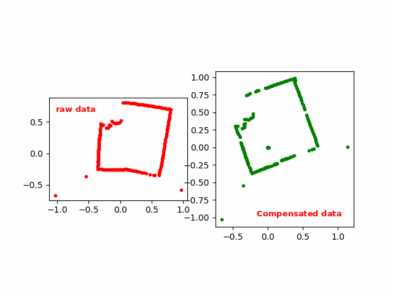
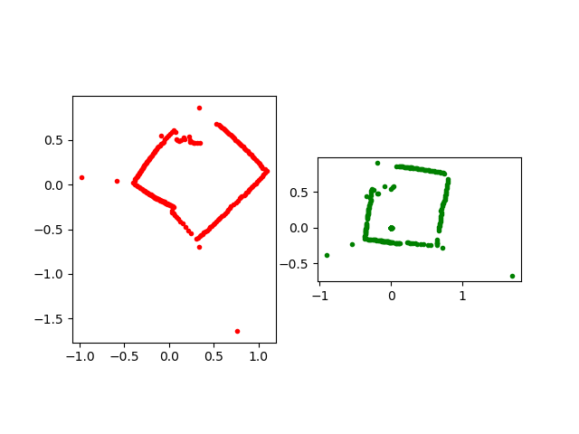
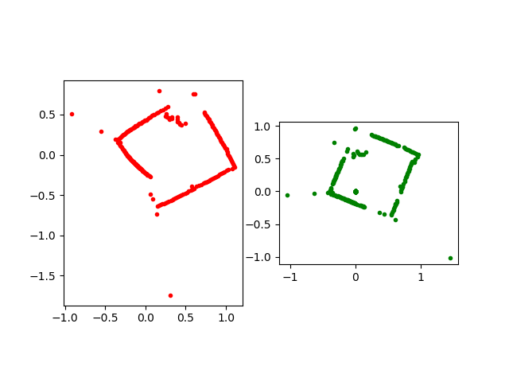
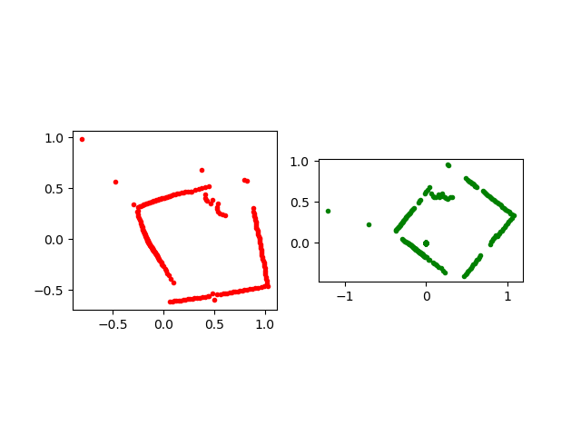
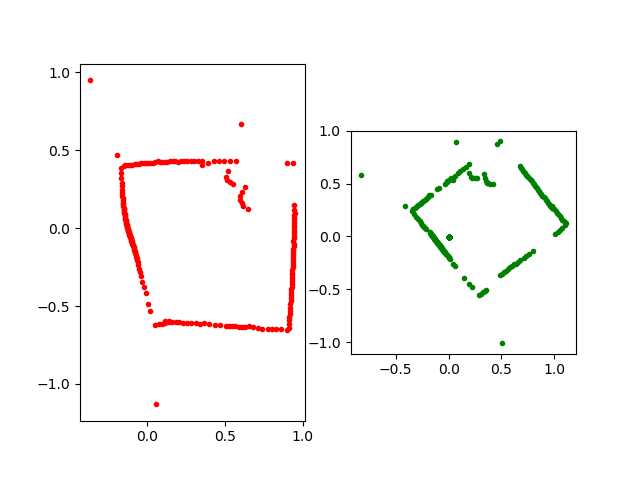
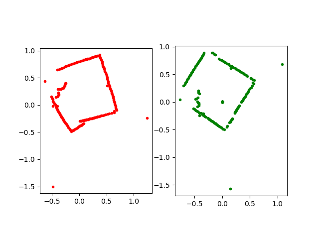

# Table of Contents

1. [Introduction](#introduction)
2. [Usage](#usage)
3. [IMU Frequency](#imu-frequency)
4. [IMU Motion compensation Result](#imu-motion-compensation-result)
5. [Contact EAI](#contact-eai)

## Introduction

Compensation is a library of lidar data distortion compensation when ydlidar lidar is installed on robot and in motion, Motion compensation needs to access high frequency IMU data or odometer data.
The default input data direction is counterclockwise(Right-hand rule).
 
## Usage

Compensator depends on [YDLIDAR/YDLidar-SDK](https://github.com/YDLIDAR/YDLidar-SDK) library. If you have never installed YDLidar-SDK library or it is out of date, you must first install YDLidar-SDK library. If you have installed the latest version of YDLidar-SDK, skip this step and go to the next step.

The core of Compensator is self-contained within a few Matrix files which you can easily compile in your application. They are all the files in the root folder of the repository (compensator.cpp, compensator.h etc.).

No specific build process is required. You can add the .cpp files to your existing project.

After Compensator is setup in your application, you can use it from _anywhere_ in your program loop:

Code:
```
#include "compensator.h"
std::unique_ptr<Compensator> compensator_ = nullptr;

/**
* @brief  Odometer data message callback function
* @param odom odometry data
*/
void OdometryMsgCallback(const odometry_t &odom) {
  compensator_->InsertOdomMsg(odom);
}

/**
* @brief Laser Scan data message callback function
* @param scan Laser scan data
*/
void LaserScanMsgCallback(const LaserScan &scan) {
  LaserScan scan_compensated;
  if (compensator_->MotionCompensation(scan, scan_compensated)) {
  }
}


```
## IMU Frequency
The most suitable formula for calculating the imu frequency is as follows:

$F_{imu} >= \frac{S_{lidar}}{40 * F_{lidar}} * F_{lidar} >= \frac{S_{lidar}}{40}$;

$F_{imu}$: IMU Frequency.

$F_{lidar}$: Lidar Frequency.

$S_{lidar}$: Lidar SampleRate.

Note:
  * When the sampling rate is large, the imu frequency can only greater than 100Hz.

## IMU Motion compensation Result

In the following figure, the raw data of the red laser data on the left and the green data on the right are the data after motion compensation, The compensated graph rotates a fixed angle.














Note: 
  * IMU Frequency: 100Hz.
  * Lidar Frequency: 5Hz.
  * Lidar SampleRate: 4000

$F_{imu} >= \frac{S_{lidar}}{40 * F_{lidar}} * F_{lidar} >= \frac{S_{lidar}}{40}$ >= 4000/40 =100;


## Contact EAI


If you have any extra questions, please feel free to [contact us](http://www.ydlidar.cn/cn/contact)
